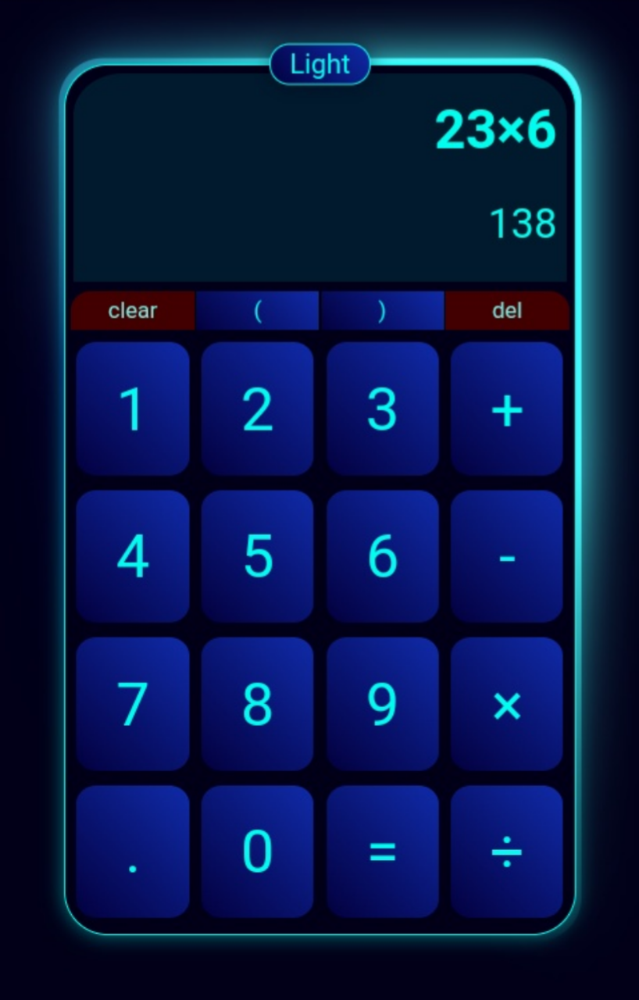
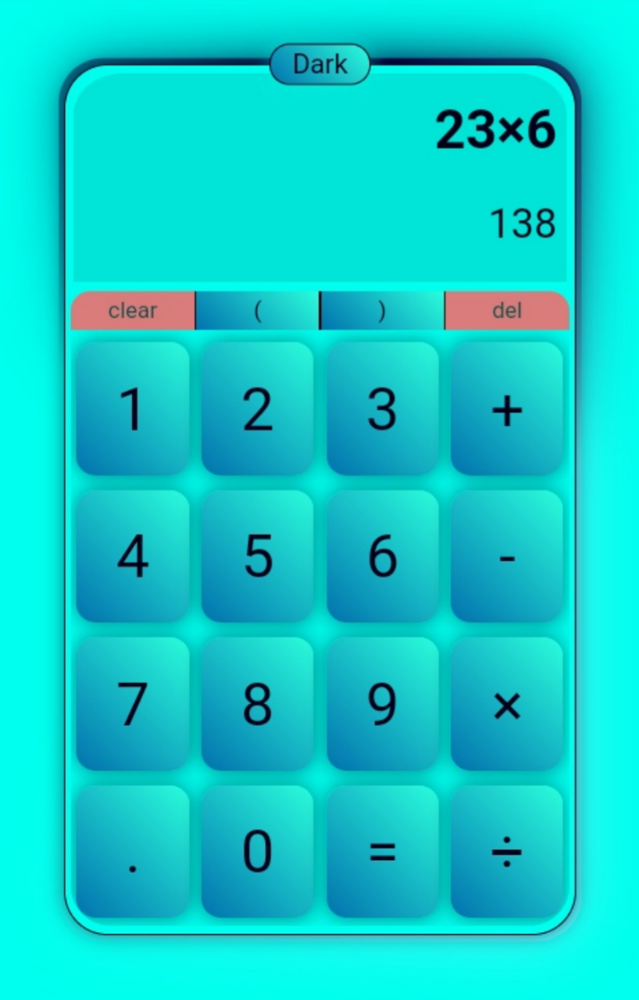

# Calculator App - README

## 📌 Overview
A sleek, responsive calculator application with dual theme support (light/dark mode) that performs basic arithmetic operations including addition, subtraction, multiplication, and division. Features include bracket support, real-time calculation, and error handling.


## Screenshots

| Dark Theme | Light Theme |
|------------|-------------|
|  | |


## ✨ Features

- **Dual Theme Support**: Toggle between light and dark modes
- **Real-time Calculation**: See results as you type
- **Full Arithmetic Operations**:
- Basic operations (+, -, ×, ÷)
- Decimal support
- Bracket support for complex expressions
- **Error Handling**: Gracefully handles division by zero and invalid expressions
- **Responsive Design**: Works on mobile and desktop
- **Visual Feedback**:
- Button press animations
- Clear animation effect
- Animated gradient background

## 🛠️ Technologies Used

- HTML5
- CSS3 (with custom properties and animations)
- JavaScript (ES6 modules)
- Git for version control

## 🚀 Installation

1. Clone the repository:
```bash
git clone https://github.com/abdu-selam/calculator-app.git
```
2. Navigate to the project directory:
```bash
cd calculator-app
```
3. Open `index.html` in your browser

## 🎨 Theme Customization

The calculator comes with two built-in themes:
- **Dark Theme** (default): Neon-inspired with cyan accents
- **Light Theme**: Bright with gradient buttons

To toggle between themes, click the theme toggle button in the top-center of the calculator.

## 📁 Project Structure

```
calculator-app/
├── index.html          # Main HTML file
├── style/
│   └── main.css       # All CSS styles
├── script/
│   ├── main.js        # UI and event handling
│   └── calculationLogic.js # Core calculation logic
└── favicon.png        # App icon
```

## 🤖 Calculation Logic

The app uses Reverse Polish Notation (RPN) for calculations:
1. Input formatting handles edge cases
2. Infix to postfix conversion
3. Postfix calculation with stack

## 🐛 Known Issues

- Multiple decimal points in a single number aren't prevented
- Very large numbers may display incorrectly
- No keyboard support (currently click/touch only)

## 💡 Future Improvements

- Add keyboard support
- Implement scientific calculator functions
- Add calculation history
- Support for percentage calculations
- Unit testing

## 📜 License

MIT License - Feel free to use and modify this project.